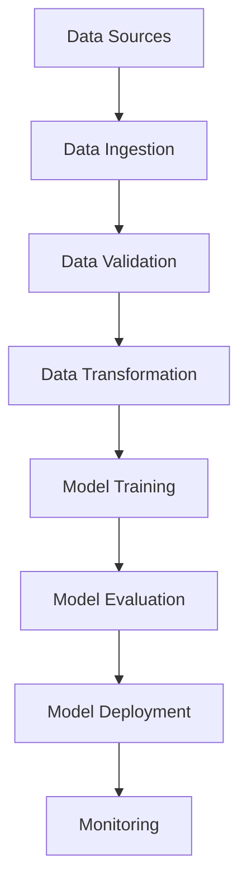

# 🚀 MLOps Project - End-to-End Machine Learning Pipeline

## 📑 Project Overview
This project implements a production-ready Machine Learning Operations (MLOps) pipeline that demonstrates industry best practices for developing, deploying, and maintaining ML models at scale. The pipeline includes automated data processing, model training, evaluation, and deployment workflows with proper logging, monitoring, and version control.

### 🎯 Key Objectives
- Build a scalable and reproducible ML pipeline
- Implement automated data validation and preprocessing
- Create robust model training and evaluation workflows
- Deploy models with monitoring capabilities
- Integrate cloud services (AWS) and databases (MongoDB)
- Containerize the application using Docker

### 🏗️ Technical Architecture


### 🛠️ Tech Stack
- **Framework:** Python, Flask
- **ML Libraries:** scikit-learn, pandas, numpy
- **Cloud:** AWS S3
- **Database:** MongoDB
- **Containerization:** Docker
- **CI/CD:** GitHub Actions
- **Logging:** Python logging
- **Testing:** pytest

### 📊 Features
1. **Data Pipeline:**
   - Automated data ingestion
   - Data validation checks
   - Schema validation
   - Data transformation

2. **ML Pipeline:**
   - Model training automation
   - Hyperparameter tuning
   - Model evaluation
   - Model registry

3. **Deployment Pipeline:**
   - Model serving API
   - Batch prediction support
   - Model versioning
   - Performance monitoring

## 🗂️ Project Structure
├── src/ │ ├── components/ # Pipeline components │ ├── configuration/ # Configuration modules │ ├── cloud_storage/ # Cloud storage utilities (AWS) │ ├── data_access/ # Data access layer │ ├── entity/ # Entity definitions │ ├── exception/ # Custom exceptions │ ├── logger/ # Logging setup │ ├── pipeline/ # ML pipelines │ └── utils/ # Utility functions ├── config/ # Configuration files ├── notebook/ # Jupyter notebooks ├── artifact/ # Model artifacts ├── static/ # Static files └── template/ # Project templates


## ⭐ Features
- 🔄 Automated ML Pipeline
- 📊 Data Ingestion and Validation
- 🔍 Data Transformation
- 🤖 Model Training
- 📈 Model Evaluation
- 🚀 Model Deployment
- ☁️ AWS Integration
- 📦 MongoDB Integration
- 🐳 Docker Support

## 🔧 Prerequisites
- Python 3.8+
- Docker
- AWS Account (for cloud storage)
- MongoDB

## ⚙️ Installation
1. Clone the repository
```bash
git clone https://github.com/yourusername/MLOps-Project.git
cd MLOps-Project
